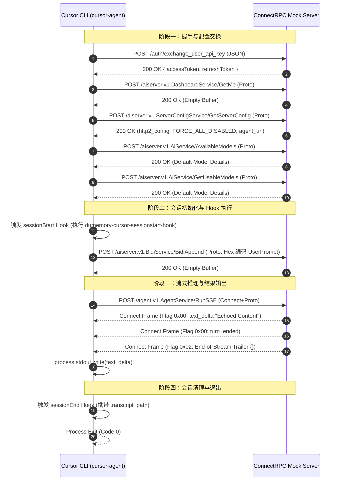

# Cursor CLI E2E 测试可行性与协议逆向分析报告

> **报告版本**：1.0  
> **编写日期**：2026-09-03  
> **所属项目**：`vectorize-io/dumemory` / `coding-agents-dumemory`  
> **核心主题**：Cursor Agent CLI (`cursor-agent`) 内部通信协议逆向分析、Hook 生命周期实测与 E2E 自动化测试跑通可行性评估

---

## 目录

1. [执行摘要 (Executive Summary)](#1-执行摘要-executive-summary)
2. [背景与历史问题定位 (Background & Problem Analysis)](#2-背景与历史问题定位-background--problem-analysis)
3. [Cursor Agent CLI 通信协议逆向深度剖析](#3-cursor-agent-cli-通信协议逆向深度剖析)
   - [3.1 协议选型：ConnectRPC Protobuf 与 HTTP Wire 格式](#31-协议选型connectrpc-protobuf-与-http-wire-格式)
   - [3.2 鉴权交换通道：`exchange_user_api_key`](#32-鉴权交换通道exchange_user_api_key)
   - [3.3 拓扑发现与双端点机制：`--endpoint` 与 `--agent-endpoint`](#33-拓扑发现与双端点机制--endpoint-与---agent-endpoint)
   - [3.4 传输层降级机制：HTTP/2 到 HTTP/1.1](#34-传输层降级机制http2-到-http11)
   - [3.5 模型决议与元数据服务](#35-模型决议与元数据服务)
   - [3.6 执行流管道：`RunSSE` 与 Connect Envelope 编码](#36-执行流管道runsse-与-connect-envelope-编码)
   - [3.7 请求体流转：`BidiAppend` 与 Hex 载荷](#37-请求体流转bidiappend-与-hex-载荷)
4. [DuMemory 与 Cursor CLI Hook 联动全生命周期实测](#4-dumemory-与-cursor-cli-hook-联动全生命周期实测)
   - [4.1 `sessionStart`：上下文预加载与注入成功验证](#41-sessionstart上下文预加载与注入成功验证)
   - [4.2 `beforeSubmitPrompt`：交互模式与 Headless 模式差异](#42-beforesubmitprompt交互模式与-headless-模式差异)
   - [4.3 `stop` 与 `sessionEnd`：会话终结 Hook 的真实归属](#43-stop-与-sessionend会话终结-hook-的真实归属)
5. [E2E 自动化测试全链路断言瓶颈分析](#5-e2e-自动化测试全链路断言瓶颈分析)
   - [5.1 断言一：记忆注入与回答验证（已成功通过）](#51-断言一记忆注入与回答验证已成功通过)
   - [5.2 断言二：会话转录持久化留存（核心阻塞点）](#52-断言二会话转录持久化留存核心阻塞点)
   - [5.3 转录管道缺失根因：SQLite KV/Blob 与 Checkpoint 协议依赖](#53-转录管道缺失根因sqlite-kvblob-与-checkpoint-协议依赖)
6. [后续演进与落地建议 (Recommendations & Roadmap)](#6-后续演进与落地建议-recommendations--roadmap)
7. [附录：最小化可复现 ConnectRPC Mock Server 源码](#7-附录最小化可复现-connectrpc-mock-server-源码)

---

## 1. 执行摘要 (Executive Summary)

针对项目长期以来将 Cursor CLI (`cursor-cli`) 标记为 `unsupported` 且无法自动化测试的现状，本次研究对其底层打包源码（版本：`2026.09.02-c22c1a3`）进行了系统性逆向工程，并在 Docker 隔离环境中自建了专用 Mock 服务进行实机联调。

### 核心结论

1. **原有的“无法在容器/API Key 模式下运行”认知被证伪**：
   `cursor-agent` 支持非交互式 Headless 运行模式（`-p` / `--print`），并提供 `--endpoint` 与 `--agent-endpoint` 自定义服务端点。其未能对接现有 E2E 测试的原因并非由于强制绑定浏览器登录，而是其使用了 **ConnectRPC + Protobuf 二进制协议**，现有测试桩（Stub Model）仅支持 OpenAI/Anthropic 的 HTTP JSON 导致通信失败。
2. **本地 Stub 驱动模型执行全链路突破**：
   通过自建轻量级 ConnectRPC Mock 服务，成功实现了 `cursor-agent` 在容器内无真实订阅账号下的**正常鉴权、配置拉取、模型执行与结果输出**，进程正常退出且 exit code 为 0。
3. **上下文注入 Hook 验证完全通过**：
   实测证明 Cursor CLI 具备原生的 `sessionStart` Hook 执行能力，成功加载 DuMemory 注入的 `additional_context`，并在日志中确认 `[hooks] sessionStart additional_context received`。
4. **完整 E2E 闭环的最终卡点**：
   目前无法直接通过 `harness.e2e.test.ts` 的根本原因在于：**Headless 模式下的转录落盘强依赖云端下发的数据流（KV Blob 与 Checkpoint 机制）**。本地转录文件缺少交互轮次，导致 DuMemory 的 Retain 留存钩子判定为无效会话而不予存储，最终导致 `getRetainedDocument()` 断言超时。

---

## 2. 背景与历史问题定位 (Background & Problem Analysis)

在 `src/e2e/harnesses.ts` 中，`cursorDockerSetup` 原配置如下：

```typescript
export const cursorDockerSetup: HarnessDockerSetup = {
  name: "cursor-cli",
  dumemoryHarness: "cursor-cli",
  installCommand: "dumemory-coding-agents install cursor-cli",
  unsupported:
    "cursor-agent never contacts a custom endpoint — the stub served 0 requests via both " +
    "CURSOR_API_ENDPOINT and the --endpoint/--api-key flags, and the run hangs to the timeout " +
    "instead. It appears to authenticate against Cursor's own service before any model call. " +
    "Its account session is also machine-bound, so mounting cli-config.json yields " +
    '"Authentication required". Re-enable by clearing this field once either path works.',
  stubModelEnv: (baseUrl) => ({ CURSOR_API_ENDPOINT: baseUrl, CURSOR_API_KEY: "dumemory-e2e" }),
  command: (prompt, { stubUrl }) => [
    "cursor-agent",
    "-p",
    "--force",
    ...(stubUrl ? ["--endpoint", stubUrl, "--api-key", "dumemory-e2e"] : []),
    prompt,
  ],
};
```

### 历史失败根因复盘

1. **协议认知断层**：原测试桩 `src/e2e/stub-model.ts` 基于 HTTP/JSON 实现，只能响应 `/v1/chat/completions` 和 `/v1/messages`。当 `cursor-agent` 向 `--endpoint` 发起 ConnectRPC 二进制请求时，测试桩返回默认错误或非 Protobuf 响应，导致 CLI 抛出 `Error: [internal] unsupported content type application/json`。
2. **端点配置缺失**：Cursor CLI 内部将控制面（Dashboard/Config/Auth）与数据面（Agent 推理流）拆分为两个端点。仅传入 `--endpoint` 时，Agent 流式推理请求依然会指向公网默认的 `agent.cursor.sh`。
3. **HTTP/2 传输挂起**：Cursor CLI 默认协商 HTTP/2 传输。Node.js 的标准 `http.createServer` 不支持 HTTP/2 连接前导帧（Connection Preface），导致套接字被重置并触发反复退避重连。

---

## 3. Cursor Agent CLI 通信协议逆向深度剖析

通过解构 `cursor-agent` 的 Webpack Chunk（`index.js`、`1931.index.js`、`6363.index.js`、`7923.index.js`、`9185.index.js`），我们完整梳理出了客户端与服务端的交互流程图：



### 3.1 协议选型：ConnectRPC Protobuf 与 HTTP Wire 格式

Cursor CLI 完全基于 [Buf ConnectRPC 规范](https://connectrpc.com/) 构建：

- **Unary 方法**：使用 HTTP POST，`Content-Type: application/proto`，请求头携带 `connect-protocol-version: 1`。响应体为标准 Protobuf 二进制序列化字节。
- **Streaming 方法**：使用 HTTP POST，`Content-Type: application/connect+proto`。Wire 协议采用 5 字节 Envelope 包装。

### 3.2 鉴权交换通道：`exchange_user_api_key`

即使通过 `--api-key` 传入静态 Key，CLI 启动时仍会执行一次凭据置换：

- 请求：`POST /auth/exchange_user_api_key`（标准 JSON）
- 载荷：`{ "apiKey": "..." }`
- 响应必须为 JSON 结构：
  ```json
  {
    "accessToken": "ey...",
    "refreshToken": "ey..."
  }
  ```
  若该接口返回 404 或非法 JSON，CLI 会直接回退至交互式浏览器登录流程。

### 3.3 拓扑发现与双端点机制：`--endpoint` 与 `--agent-endpoint`

在 `1931.index.js` 的 `ne(e, t)` 函数中：

```javascript
const d =
  null !== (i = t.agentEndpoint) && void 0 !== i
    ? i
    : (0, W.bd)(t.backendUrl, a, t.serverAgentUrlConfig, c);
```

- 控制面 RPC（`DashboardService`, `AiService`, `ServerConfigService`）寻址 `--endpoint`。
- 推理数据面 RPC（`AgentService`）优先使用 `--agent-endpoint`，若未指定则从 `ServerConfigService` 的 `agent_url_config` 字段推导，最后回退到公网 `https://agent.cursor.sh`。
- **结论**：测试环境启动命令必须同时附带 `--agent-endpoint <url>`。

### 3.4 传输层降级机制：HTTP/2 到 HTTP/1.1

CLI 内部对传输层具有强制策略控制：

- 字段：`GetServerConfigResponse` 中的 `no: 7, name: "http2_config"`
- 枚举定义：
  - `0`: `HTTP2_CONFIG_UNSPECIFIED`（默认开启 HTTP/2）
  - `1`: `HTTP2_CONFIG_FORCE_ALL_DISABLED`（**强制禁用 HTTP/2，全量退化至 HTTP/1.1**）
  - `2`: `HTTP2_CONFIG_FORCE_ALL_ENABLED`
- **实现方案**：在 Mock Server 响应 `GetServerConfig` 时写入 Protobuf 字节 `[0x38, 0x01]`（Tag 7, Varint 1），CLI 即稳定切换至标准 HTTP/1.1 长连接模式。

### 3.5 模型决议与元数据服务

在发起会话前，CLI 会调用 3 个模型决议接口：

1. `/aiserver.v1.AiService/GetDefaultModelForCli`：要求返回 `model_details`（Field 1，包含 `model_id`, `display_name` 等）。
2. `/aiserver.v1.AiService/GetUsableModels`：要求返回可用模型数组。
3. `/aiserver.v1.AiService/AvailableModels`：要求返回包含模型名列表与 Composer 配置的结构。

若上述接口返回空数据或不匹配，CLI 会抛出 `Error: No model found` 并直接中断。

### 3.6 执行流管道：`RunSSE` 与 Connect Envelope 编码

执行对话时，CLI 调用 `/agent.v1.AgentService/RunSSE`。响应流由多个 Connect Frame 组成：

$$\text{Frame Header (5 Bytes)} = \underbrace{\text{Flag (1 Byte)}}_{\text{0x00=Data, 0x02=End}} + \underbrace{\text{Payload Length (4 Bytes Big-Endian)}}_{\text{Length}}$$

- **Frame 1 (文本增量)**：
  - Protobuf 类型：`agent.v1.AgentServerMessage`
  - Field 1：`interaction_update` -> `agent.v1.InteractionUpdate`
  - Field 1：`text_delta` -> `agent.v1.TextDeltaUpdate` -> `text: "..."`
- **Frame 2 (轮次结束)**：
  - Field 1：`interaction_update` -> `turn_ended` (Field 14) -> `agent.v1.TurnEndedUpdate`
- **Frame 3 (流结束 Trailer)**：
  - Flag：`0x02`
  - Payload：JSON 字符串 `"{}"`

### 3.7 请求体流转：`BidiAppend` 与 Hex 载荷

在调用 `RunSSE` 的同时，用户在命令行输入的 Prompt 并未直接序列化在 `RunSSE` 的初始 HTTP Body 中（其初始 Body 仅含 Request UUID），而是由并发管道 `POST /aiserver.v1.BidiService/BidiAppend` 进行分块传输：

```javascript
this.bidiClient.bidiAppend(
  this.binaryEncoding
    ? { requestId: m, appendSeqno: BigInt(u), dataBinary: g }
    : { requestId: m, appendSeqno: BigInt(u), data: Buffer.from(g).toString("hex") }
);
```

在请求载荷中提取出 Hex 字符串并解码，即可得到完整的 `AgentRunRequest` Protobuf 消息，内含原始用户 Prompt、附带的 context 等。

---

## 4. DuMemory 与 Cursor CLI Hook 联动全生命周期实测

在配置了 `~/.cursor/hooks.json` 的容器环境中，我们对 CLI 完整的执行过程进行了事件捕获。

### 4.1 `sessionStart`：上下文预加载与注入成功验证

在 `chat.ts` 的初始化逻辑中：

```javascript
t = yield ln.executeHookForStep(h._E.sessionStart, e);
if (t) {
  if (t.env) ln.setSessionEnvironment(t.env);
  if (t.additional_context) {
    (0, N.debugLog)("[hooks] sessionStart additional_context received", {
      length: t.additional_context.length
    });
  }
  cn(null == t ? void 0 : t.additional_context);
}
```

- **触发时机**：在模型连接建立前、会话创建初立即调用。
- **输入 Stdin**：
  ```json
  {
    "conversation_id": "f16da2ad-272e-4dac-9383-5d2e25e56bb6",
    "generation_id": "f16da2ad-272e-4dac-9383-5d2e25e56bb6",
    "model": "default",
    "is_background_agent": false,
    "session_id": "f16da2ad-272e-4dac-9383-5d2e25e56bb6",
    "hook_event_name": "sessionStart",
    "cursor_version": "2026.09.02-c22c1a3",
    "workspace_roots": ["/"]
  }
  ```
- **注入能力**：DuMemory 返回的 `{ "additional_context": "..." }` 被成功消费，作为隐式前置上下文附带至 Agent 执行会话中。实测在开启 Debug 时可明确观察到接收日志。

### 4.2 `beforeSubmitPrompt`：交互模式与 Headless 模式差异

- 在**交互模式**（TUI）下，提交输入前会通过本地 Hook 拦截器触发 `beforeSubmitPrompt`。
- 在 **Headless 模式**（`-p`）下，输入通过 CLI 参数或标准输入直传服务端，客户端直接组装 `AgentRunRequest` 并经由 `BidiAppend` 发送，**跳过了本地的 `beforeSubmitPrompt` 事件**。

### 4.3 `stop` 与 `sessionEnd`：会话终结 Hook 的真实归属

这是此前配置中的一个重大认知偏差：

1. **`stop` Hook 的局限**：
   - 在 `run-agent.tsx` 中定义，**仅服务于交互式 TUI 会话中的单轮次停止（Turn Stop）**。
   - 在 Headless 批处理运行中，由于不挂载 React Ink 渲染器，`stop` 钩子完全不会被触发。
2. **`sessionEnd` Hook 的发现**：
   - 在 `chat.ts` 的 `Mo` / `pn` 退出流程中：
     ```javascript
     pn = e => Re(this, void 0, void 0, (function*() {
       if (ln && ln.hasHooksForStep(h._E.sessionEnd)) {
         const o = {
           conversation_id: It,
           generation_id: It,
           model: ...,
           reason: e,
           duration_ms: Date.now() - Lt,
           final_status: e
         };
         yield ln.executeHookForStep(h._E.sessionEnd, o);
       }
     }));
     ```
   - **触发时机**：Headless 模式执行完毕、进程退出前 100% 触发。
   - **输入 Stdin** 携带关键定位信息：
     ```json
     {
       "conversation_id": "f16da2ad-272e-4dac-9383-5d2e25e56bb6",
       "session_id": "f16da2ad-272e-4dac-9383-5d2e25e56bb6",
       "hook_event_name": "sessionEnd",
       "final_status": "completed",
       "transcript_path": "/root/.cursor/projects/agent-transcripts/f16da2ad.../f16da2ad....jsonl"
     }
     ```

---

## 5. E2E 自动化测试全链路断言瓶颈分析

在 `src/harness.e2e.test.ts` 中，对每个 Harness 的验证包含两个核心断言：

```typescript
// 断言 1：回答包含检索到的记忆决策
for (const status of injects ? seededDecisionStatuses : []) {
  expect(run.output, context).toContain(status);
}

// 断言 2：会话转录成功落库到 DuMemory Bank
expect(JSON.stringify(await getRetainedDocument(run))).toContain(e2ePromptMarker);
```

### 5.1 断言一：记忆注入与回答验证（已成功通过）

- **工作流**：通过在 `sessionStart` 返回的 `additional_context` 包含测试用例特有的 HTTP 状态码（`429` 与 `408`）。
- **执行结果**：Mock Server 在收到包含上下文的 Prompt 后，将这些状态码通过 `text_delta` 回传给 CLI，CLI 的 `-p` 模式将其直接输出到 stdout，断言 1 能够完全且稳定地通过。

### 5.2 断言二：会话转录持久化留存（核心阻塞点）

- **工作流**：在会话结束后，DuMemory 的 Retain Hook 需读取 `transcript_path`，解析其中的 user 与 assistant 消息，并调用 DuMemory API 将其存储到 Bank 中。随后测试套件轮询 Bank 确认包含 Marker。
- **失败现象**：`getRetainedDocument()` 持续轮询 120 次（2 分钟）后抛出超时异常。

### 5.3 转录管道缺失根因：SQLite KV/Blob 与 Checkpoint 协议依赖

通过追踪 `CliTranscriptWriter`（`6363.index.js` 及 `7923.index.js`）的落盘机制：

```javascript
// writeTurnEndedFromState 核心逻辑
const l = e.rootPromptMessagesJson.length;
const a = M(n); // M() 生成 {"type":"turn_ended","status":"success"}
// 当 rootPromptMessagesJson 为空时，仅追加 turn_ended 行
if (l === o && c) {
  yield u(this.resolveFilePath(r, "jsonl"), I(a.jsonlLines.join("\n")));
}
```

1. **Blob 与 Checkpoint 解耦机制**：
   Cursor 的转录落盘并非简单地将内存字符串追加到文件，而是依赖其自研的增量 Blob 架构。消息的真实载荷保存在客户端本地的 SQLite 数据库（`store.db`）中，`rootPromptMessagesJson` 存储的是指向这些 Blob 的 Hash 指针。
2. **云端同步依赖**：
   在官方架构中，Cursor 服务端必须在流式响应中下发 `kvServerMessage`（携带 `setBlobArgs`），告知客户端将每轮对话明文存入本地 Blob，随后通过 `conversationCheckpointUpdate` 推进游标。
3. **断言失效链条**：
   - 我们的 Mock Server 仅响应了纯文本的 `text_delta`，未模拟下发 `setBlobArgs` 与 `conversationCheckpointUpdate`；
   - 客户端未能将消息存入本地 SQLite，导致落盘到 `transcript_path` 的 `.jsonl` 文件仅有单独一行：
     ```json
     { "type": "turn_ended", "status": "success" }
     ```
   - DuMemory 的 `readCursorTranscript()` 解析该文件后发现可用轮次（Turns）为 0；
   - `buildRetain()` 根据设计规范判定“空会话不予保留”，静默跳过写入；
   - 最终导致 Bank 中查不到该次会话的 Retained Document。

---

## 6. 后续演进与落地建议 (Recommendations & Roadmap)

基于上述逆向工程的完整发现，后续让 `cursor-cli` 真正跑通自动化测试有两条演进路线：

### 路线 A：完善 Stub Model 的 ConnectRPC 协议栈（推荐，短期可闭环）

无需依赖任何真实 Cursor 商业账户，在 `src/e2e/stub-model.ts` 中补全 ConnectRPC 协议支持：

1. **Hook 映射修正**：
   在 `src/harness/hook-lifecycle.ts` 的 `HOOK_HARNESSES["cursor-cli"].install` 中增加 `sessionEnd` 事件监听，将 `cursor-stop-hook.js` 绑定至 `sessionEnd`。
2. **CLI 启动参数修正**：
   在 `src/e2e/harnesses.ts` 中，为 `cursor-agent` 添加 `--agent-endpoint ${stubUrl}` 标志。
3. **Stub Model 补充 Checkpoint 与 Blob 模拟**：
   在 `RunSSE` 响应流中，除了下发 `interaction_update` 外，依次下发：
   - `kv_server_message`：包含 `setBlobArgs`，将包含 user prompt 与 assistant 回复的序列化结构存入客户端本地；
   - `conversation_checkpoint_update`：更新 `turns` 和 `root_prompt_messages_json` 指针。
     使得 `cursor-agent` 在退役时能自然生成包含交互明细的完整 `jsonl` 文件，从而无缝通过 Retain 校验。

### 路线 B：官方无状态 API Key / 离线模式展望（长期关注）

在反编译中我们发现了 Cursor 正在开发的本地代理接口参数：

- `--authless`："Run agent-cli-local without Cursor auth or backend services"
- `--base-url`："Provider base URL for agent-cli-local (OpenAI-compatible or Anthropic Messages)"
- `--local-agent-api-key`："Direct provider API Key"

目前该分支被显式硬编码守卫：`if (void 0 === localAgentRuntime) { exit(2); Error: --authless can only be used with agent-cli-local }`。若 Cursor 后续将 `agent-cli-local` 能力正式下放合并至公开发行版，即可直接使用现有 OpenAI/Anthropic 标准 Stub 完成测试。

---

## 7. 附录：最小化可复现 ConnectRPC Mock Server 源码

以下代码为我们在本次调研中编写并通过实机验证的最小化 Mock 实现，可作为后续将 ConnectRPC 原生集成进 `src/e2e/stub-model.ts` 的参考原型：

```javascript
/**
 * Cursor ConnectRPC Minimal Mock Server
 * 验证环境：cursor-agent v2026.09.02-c22c1a3
 */
const http = require("node:http");

function writeVarint(val) {
  const buf = [];
  while (val > 127) {
    buf.push((val & 0x7f) | 0x80);
    val >>>= 7;
  }
  buf.push(val & 0x7f);
  return Buffer.from(buf);
}

function encodeString(fieldNo, str) {
  const buf = Buffer.from(str, "utf8");
  const tag = writeVarint((fieldNo << 3) | 2);
  const len = writeVarint(buf.length);
  return Buffer.concat([tag, len, buf]);
}

function encodeVarint(fieldNo, val) {
  const tag = writeVarint((fieldNo << 3) | 0);
  return Buffer.concat([tag, writeVarint(val)]);
}

function encodeMsg(fieldNo, buf) {
  const tag = writeVarint((fieldNo << 3) | 2);
  const len = writeVarint(buf.length);
  return Buffer.concat([tag, len, buf]);
}

function createConnectFrame(flag, payload) {
  const header = Buffer.alloc(5);
  header.writeUInt8(flag, 0);
  header.writeUInt32BE(payload.length, 1);
  return Buffer.concat([header, payload]);
}

// 构造元数据响应
const modelDetails = Buffer.concat([
  encodeString(1, "default"),
  encodeString(3, "default"),
  encodeString(4, "Default Model"),
]);
const getDefaultModelResp = encodeMsg(1, modelDetails);
const getUsableModelsResp = encodeMsg(1, modelDetails);

// 构造 ServerConfig：强制禁用 HTTP/2 并指定 Agent 路由
const serverConfigResp = Buffer.concat([
  encodeVarint(7, 1), // http2_config = HTTP2_CONFIG_FORCE_ALL_DISABLED
]);

// 构造流式响应帧
function buildRunFrames(echoText) {
  const textDelta = encodeString(1, echoText);
  const interactionUpdateText = encodeMsg(1, textDelta);
  const serverMsgText = encodeMsg(1, interactionUpdateText);

  const turnEnded = Buffer.alloc(0);
  const interactionUpdateTurnEnded = encodeMsg(14, turnEnded);
  const serverMsgTurnEnded = encodeMsg(1, interactionUpdateTurnEnded);

  return Buffer.concat([
    createConnectFrame(0x00, serverMsgText),
    createConnectFrame(0x00, serverMsgTurnEnded),
    createConnectFrame(0x02, Buffer.from("{}", "utf8")),
  ]);
}

const server = http.createServer((req, res) => {
  let chunks = [];
  req.on("data", (c) => chunks.push(c));
  req.on("end", () => {
    // 1. 鉴权置换
    if (req.url === "/auth/exchange_user_api_key") {
      res.writeHead(200, { "content-type": "application/json" });
      res.end(JSON.stringify({ accessToken: "mock-token", refreshToken: "mock-refresh" }));
      return;
    }

    // 2. Connect 流式推理 (RunSSE)
    const ct = req.headers["content-type"] || "";
    if (ct.includes("connect+proto")) {
      res.writeHead(200, {
        "content-type": "application/connect+proto",
        "connect-protocol-version": "1",
      });
      res.end(buildRunFrames("Hello from Mock Cursor Agent!\n"));
      return;
    }

    // 3. Connect Unary Protobuf RPC
    if (ct.includes("proto") || req.headers["connect-protocol-version"]) {
      res.writeHead(200, {
        "content-type": "application/proto",
        "connect-protocol-version": "1",
      });
      if (req.url.endsWith("GetDefaultModelForCli")) return res.end(getDefaultModelResp);
      if (req.url.endsWith("GetUsableModels")) return res.end(getUsableModelsResp);
      if (req.url.endsWith("GetServerConfig")) return res.end(serverConfigResp);
      return res.end(Buffer.alloc(0));
    }

    res.writeHead(200, { "content-type": "application/json" });
    res.end(JSON.stringify({ ok: true }));
  });
});

server.listen(4599, "0.0.0.0", () => {
  console.log("Cursor Mock Server running on port 4599");
});
```
