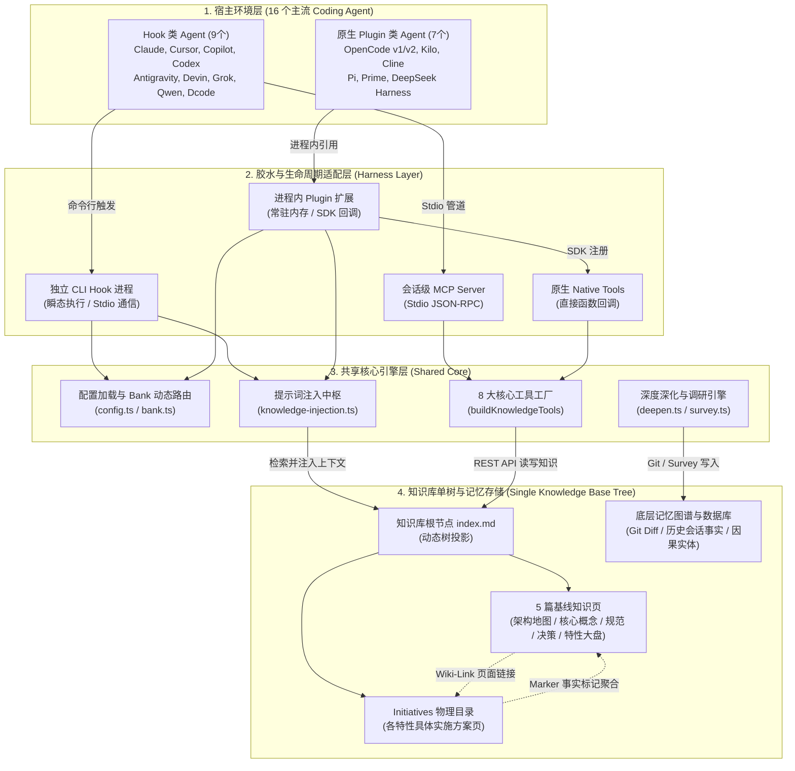
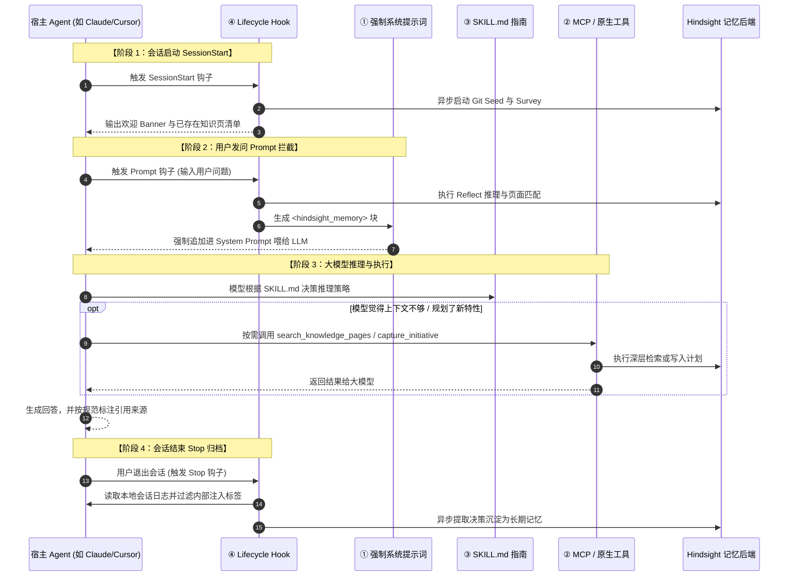
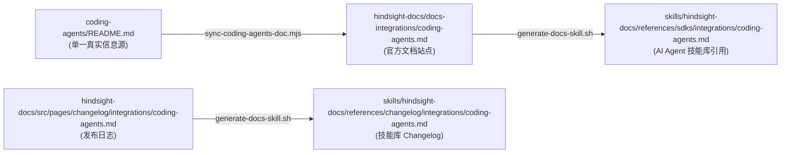

# Hindsight Coding Agents 核心机制、知识库与多 Agent 集成深度剖析

本文档全面深入剖析了 Hindsight 统一多 Agent 插件（源码位于 `hindsight-integrations/coding-agents`，npm 包名为 `@vectorize-io/hindsight-coding-agents`）的核心架构设计、交互层四大支柱、8 大核心工具、知识库 OKF 规范与单树拓扑、系统基座层五大能力以及全量运行配置。

> [!NOTE]
> 本文档仅涵盖**新版统一插件架构**，已完全排除已被弃用或取代的旧版单 Agent 插件（如旧的单体 `claude-code/`、`codex/` 等）。

---

## 📑 目录导航（Table of Contents）

```
├── 1. 插件源码核心架构（hindsight-integrations/coding-agents/）
│   ├── 1.1 核心业务逻辑层（src/core/）
│   ├── 1.2 生命周期与 Harness 适配层（src/harness/）
│   ├── 1.3 根入口与 CLI 二进制（src/）
│   │   ├── 1.3.1 统一管理与底层服务 CLI
│   │   ├── 1.3.2 基于 Hook 二进制调用的 Agent（共 9 个）
│   │   ├── 1.3.3 基于原生 Plugin / Extension 模块调用的 Agent（共 7 个）
│   │   └── 1.3.4 两种接入机制深度对照矩阵
│   └── 1.4 技能文档与构建辅助目录
├── 2. 交互层四大支柱能力深度解析与协同闭环
│   ├── 2.1 强制追加系统提示词（Context Injection）
│   ├── 2.2 MCP / 原生注册工具按需调用（On-Demand Tools）
│   ├── 2.3 伴生技能（Skills / SKILL.md）与自愈纠错协议
│   ├── 2.4 Hook 强制生命周期调度（Lifecycle Hooks）
│   └── 2.5 四大支柱协同流转时序图
├── 3. 核心工具层全景分析（8 大核心工具分类、Schema 与 REST API 映射）
│   ├── 3.1 知识页维度分类（4 个操作知识页 vs 4 个非知识页）
│   ├── 3.2 双通道注册对齐架构（MCP Server vs 原生 Plugin）
│   ├── 3.3 工业级安全设计规范（Zero-Delete & Non-Destructive）
│   └── 3.4 运行时大模型工具选用决策树（Tool Selection Decision Tree）
├── 4. 知识库系统全景设计（OKF 规范、单树拓扑与知识页分类）
│   ├── 4.1 核心架构哲学：单代码库单树拓扑（Single Knowledge Base Tree）
│   ├── 4.2 知识页五大核心分类体系（Seeded Taxonomy）
│   ├── 4.3 “总览大盘页”与“Initiatives/ 文件夹”的联动拓扑
│   ├── 4.4 页面格式标准：OKF（Open Knowledge Format）
│   ├── 4.5 导航索引与版本快照机制（index.md 与 log.md）
│   └── 4.6 防幻觉作用域隔离（pageScopeRule）
├── 5. 系统基座层五大支撑能力深度解析与 Agent 支持矩阵
│   ├── 5.1 宿主终端 UI / 状态栏扩展（TUI Statusline）
│   ├── 5.2 专用子 Agent 注入与自主代码库调研（Headless Survey Agent）
│   ├── 5.3 Git 历史决策自动挖掘与渐进式深化（Git Seeding & Deepening）
│   ├── 5.4 历史聊天记录离线回填（History Backfill / --import-conversations）
│   ├── 5.5 本地守护进程托管与静默自更新（Daemon Lifecycle & Auto-Update）
│   └── 5.6 系统基座层 16 个 Agent 支持矩阵全景图
├── 6. 外部与全局文档同步目录
├── 7. 插件运行时与宿主操作系统交互的关键目录
│   ├── 7.1 Hindsight 自身公共基础目录
│   │   ├── 7.1.1 安装命令参数与配置文件对应关系表
│   │   └── 7.1.2 配置文件运行时高级参数全景表（30+ 项参数）
│   └── 7.2 宿主各大 Agent（全部 16 个）专属配置与会话转录目录
└── 8. 测试与验证相关目录
```

### 🏛️ 全景分层架构与数据流向总览



---

## 1. 插件源码核心架构（`hindsight-integrations/coding-agents/`）

插件源码采用**共享核心逻辑（Core）+ 统一生命周期抽象（Harness）+ 多 Agent 薄入口（Hooks/CLI）**的分层架构。

```
hindsight-integrations/coding-agents/
├── src/                          # 核心源码
│   ├── core/                     # 记忆系统核心逻辑实现
│   ├── harness/                  # Agent Harness 抽象与生命周期定义
│   ├── e2e/                      # 端到端测试驱动与 Stub 模型
│   ├── installer.ts              # 统一安装/卸载/更新入口 (CLI)
│   ├── install-ui.ts             # 交互式终端安装界面
│   ├── mcp-server.ts             # 通用 Model Context Protocol (MCP) 服务
│   └── *-hook.ts                 # 各 Agent 独立的 Hook 入口 (CLI Binaries)
├── hooks/                        # Hook 配置文件规范 (hooks.json)
├── skill/                        # 构建后产出的 Agent Companion Skill (SKILL.md)
├── skill-src/                    # Skill 文档构建源文件 (preamble.md)
├── scripts/                      # 辅助构建脚本 (build-skill.mjs)
├── e2e/                          # 容器化 E2E 测试环境 (各类 Agent Dockerfiles)
├── dist/                         # tsup 编译产物目录
├── plugin.json                   # 遵循 Agent Plugin 规范的插件声明
├── package.json                  # npm 包清单配置及 bin 定义
└── cordis.patch.yml              # DeepSeek Harness (DSH) 插件补丁定义
```

### 1.1 核心业务逻辑层：`src/core/`

负责处理记忆存取、配置管理、本地守护进程调度以及各大 Agent 转录文本的解析。

| 文件 / 模块              | 职责与功能说明                                                                                                                                                                                                                                                                      |
| :----------------------- | :---------------------------------------------------------------------------------------------------------------------------------------------------------------------------------------------------------------------------------------------------------------------------------- |
| `config.ts`              | 多层级配置加载解析器。管理`~/.hindsight/coding-agent.json`、项目根目录配置及环境变量。                                                                                                                                                                                              |
| `daemon.ts`              | 本地 Hindsight 守护进程生命周期管理（端口探测、启动、健康检查、本地 LLM 探测）。                                                                                                                                                                                                    |
| `bank.ts`                | 动态 Bank 映射与管理。根据 Git 仓库根目录自动隔离或分配记忆库（Memory Bank）。                                                                                                                                                                                                      |
| `hindsight.ts`           | Hindsight 后端 API 交互客户端，负责知识页面检索、会话保留、Recall/Retain 协议实现。                                                                                                                                                                                                 |
| `knowledge-injection.ts` | 记忆与知识注入逻辑。在用户提问或会话启动时组装上下文提示词。                                                                                                                                                                                                                        |
| `knowledge-tools.ts`     | 暴露给各 Agent 的 MCP / 原生工具定义（`hindsight_recall`, `hindsight_retain` 等）。                                                                                                                                                                                                 |
| `session-start.ts`       | 会话启动钩子实现。加载架构文档、代码约定及进行中的活跃倡议（Initiatives）。                                                                                                                                                                                                         |
| `retain-hook.ts`         | 会话结束（Stop Hook）逻辑。自动触发后台转录解析并将最新对话提炼为记忆。                                                                                                                                                                                                             |
| `history.ts`             | 历史记录扫描与导入逻辑（支持`--import-conversations` 批量恢复过去会话）。                                                                                                                                                                                                           |
| `survey.ts`              | 首次安装时的代码库探测与初始化，自动提取项目知识并生成基线页面。                                                                                                                                                                                                                    |
| `auto-update.ts`         | 后台静默检测 npm 最新版本并自动暂存热更运行时。                                                                                                                                                                                                                                     |
| `transcript-*.ts`        | 各 Agent 专用的会话转录日志解析器：• `transcript-antigravity.ts`• `transcript-codex.ts`• `transcript-cursor.ts`• `transcript-copilot.ts`• `transcript-devin.ts`• `transcript-dcode.ts`• `transcript-grok.ts`• `transcript-qwen.ts`• `transcript-opencode.ts`• `transcript-pi.ts` 等 |

> [!IMPORTANT]
> **零遥测与网络边界安全声明（Zero-Telemetry & Network Boundary）**：
>
> - **100% 零埋点、零用户跟踪、零遥测回传**：插件源码中不包含任何 PostHog、Mixpanel、Google Analytics 或私有分析打点 SDK；
> - **外联网络严格受限**：运行时网络请求仅收敛于以下两项必要通道，绝无隐蔽外联：
>   1. **Hindsight 服务端 HTTP API**：由配置中的 `apiUrl` 指定（默认为本地 daemon `127.0.0.1:8888` 或企业私有部署服务端）；
>   2. **npm 官方 Registry**：用于每 24 小时进行一次插件新版本查询，若配置 `autoUpdate: false` 或处于离线隔离网络，该请求将被彻底旁路；
> - **会话清洗保护**：在转录解析器（如 `transcript-qwen.ts`）中，还会主动过滤宿主环境中可能残留的主机遥测标记，严防私密元数据泄漏。

---

### 1.2 生命周期与 Harness 适配层：`src/harness/`

统一纳管各 Agent 之间差异巨大的钩子协议与交互格式。

| 模块                           | 职责与功能说明                                                                                                                                                                   |
| :----------------------------- | :------------------------------------------------------------------------------------------------------------------------------------------------------------------------------- |
| `hook-lifecycle.ts`            | **单一生命周期契约**。注册所有基于 Hook 的 Harness（Claude, Cursor, Copilot, Codex, Antigravity, Devin, Grok, Dcode, Qwen 等），标准化 `sessionStart`、`prompt` 与 `stop` 事件。 |
| `registry.ts`                  | 插件能力注册表与检测器。                                                                                                                                                         |
| `opencode.ts` / `opencode2.ts` | OpenCode v1 及 v2 的原生插件绑定实现。                                                                                                                                           |
| `pi-extension.ts`              | Pi 和 Prime Agent 的原生扩展接口适配。                                                                                                                                           |

---

### 1.3 根入口与 CLI 二进制：`src/`

编译后映射到 `package.json` 的 `bin` 字段及 `tsup.config.ts` 打包清单，作为独立可执行脚本或模块供各 Agent 加载：

#### 1.3.1 统一管理与底层服务 CLI

- **统一安装/卸载/更新器**：`installer.ts` / `install-ui.ts` (`hindsight-coding-agents`)
- **通用 MCP 服务器**：`mcp-server.ts` (`@vectorize-io/hindsight-coding-agents/mcp-server`)
  - **启动时机**：并非后台常驻系统服务，而是在宿主 Agent（如 Claude Code、Cursor、Codex 等）启动交互或打开项目窗口时，由宿主进程作为子进程通过 Stdio 管道拉起；
  - **会话级隔离**：每个终端会话/窗口拉起一个独立的 `mcp-server.js` 子进程（因 Stdio 管道 1 对 1 绑定），各自继承所在目录（`cwd`）并绑定对应的 Memory Bank，会话关闭时自动销毁。
- **后台守护进程引导**：`daemon-start.ts`（以 Detached 模式在后台静默启动 local daemon）
- **诊断与状态监控**：`status.ts`
- **知识深化与初始化工具**：`deepen.ts`、`hindsight-seed.ts`

#### 1.3.2 基于 Hook 二进制调用的 Agent（共 9 个）

宿主 Agent 在 `SessionStart`、`Prompt`、`Stop` 等生命周期节点通过操作系统进程方式直接调用以下 Entrypoint：

1. **Claude Code**：`claude-hook.ts`、`claude-sessionstart-hook.ts`、`claude-stop-hook.ts`
2. **Cursor CLI**：`cursor-hook.ts`、`cursor-sessionstart-hook.ts`、`cursor-stop-hook.ts`
3. **GitHub Copilot CLI**：`copilot-hook.ts`、`copilot-sessionstart-hook.ts`、`copilot-stop-hook.ts`
4. **OpenAI Codex CLI**：`codex-hook.ts`、`codex-sessionstart-hook.ts`、`codex-stop-hook.ts`
5. **Google Antigravity CLI**：`antigravity-hook.ts`、`antigravity-stop-hook.ts`、`antigravity-statusline.ts`
6. **Devin CLI**：`devin-hook.ts`、`devin-sessionstart-hook.ts`、`devin-stop-hook.ts`
7. **Grok Build**：`grok-hook.ts`、`grok-sessionstart-hook.ts`、`grok-stop-hook.ts`
8. **Qwen Code**：`qwen-hook.ts`、`qwen-sessionstart-hook.ts`、`qwen-stop-hook.ts`
9. **DeepAgents Dcode**：`dcode-hook.ts`、`dcode-sessionstart-hook.ts`、`dcode-stop-hook.ts`

#### 1.3.3 基于原生 Plugin / Extension 模块调用的 Agent（共 7 个）

宿主 Agent 通过进程内模块导入或专用插件系统直接运行以下 Entrypoint：

10. **OpenCode (v1)**：`index.ts`（作为 npm 主入口，供 `opencode.json` 的 `plugin` 加载）
11. **OpenCode v2**：`opencode2.ts`（适配 v2 重构后的新版插件契约）
12. **Kilo CLI**：`kilo.ts`（作为 OpenCode fork 版本的持久插件）
13. **Cline CLI**：`cline.ts`（通过 `cline plugin install` 加载原生 in-process 模块，拦截 `beforeModel` 请求）
14. **DeepSeek Harness (DSH)**：`dsh.ts`（作为 Cordis 插件行加载）
15. **Pi**：`pi.ts`（在 `~/.pi/agent/settings.json` 中配置为 extension 加载）
16. **Prime Agent**：`prime-agent.ts`（Pi 派生架构的独立扩展）

#### 1.3.4 两种接入机制深度对照矩阵

> [!NOTE]
> **关于“强制调用”与“按需调用”的架构定位**：
> 无论采用哪种机制，Hindsight 均为其同时提供 **“强制隐式拦截（生命周期 Hooks）”** 与 **“显式按需查询（工具 Tools）”** 双重机制。两者的根本差异在于宿主平台的系统开放度与技术承载形式：

| 比较维度                           | 基于 Hook 二进制调用的 Agent                                                                                                                        | 基于原生 Plugin / Extension 模块的 Agent                                                                            |
| :--------------------------------- | :-------------------------------------------------------------------------------------------------------------------------------------------------- | :------------------------------------------------------------------------------------------------------------------ |
| **涵盖 Agent**                     | **Claude Code**、**Cursor CLI**、**GitHub Copilot**、**Codex CLI**、**Antigravity**、**Qwen Code**、**Grok Build**、**Devin**、**Dcode**（共 9 个） | **OpenCode (v1/v2)**、**Kilo CLI**、**Cline CLI**、**Pi**、**Prime Agent**、**DeepSeek Harness (DSH)**（共 7 个）   |
| **进程模型**                       | **跨进程（Out-of-Process）**宿主通过子进程命令行（`exec`/`fork`）每次拉起新的 Node 脚本执行                                                         | **进程内（In-Process）**宿主在启动阶段通过 `import()` / `require()` 将插件常驻加载至主进程或 Worker 线程            |
| **通信机制**                       | 标准 I/O（`stdin`/`stdout`）、CLI 参数、临时文件与退出码                                                                                            | 内存直接对象传递（JavaScript 函数回调、Promise、内部事件总线）                                                      |
| **生命周期拦截(强制自动调用)**     | **命令行外部 Hook**例如 `claude-hook.js`、`cursor-sessionstart-hook.js`，每轮自动执行，无需大模型决策                                               | **进程内 Hook 回调**例如 OpenCode 的 `chat.message`、`system.transform`，Cline 的 `beforeModel`，由宿主每轮自动触发 |
| **工具能力扩展(模型按需调用)**     | **外部独立 MCP Server**必须配合通过 stdio 运行的 `mcp-server.ts` 进程，由大模型自主调用工具                                                         | **宿主原生 Native Tools**直接调用宿主 SDK 的 `tool()` 接口注册为本地工具，**无需启动独立的 MCP 服务**               |
| **请求篡改深度(Context Mutation)** | 受限于宿主命令行契约，多为只读或受限注入（如追加文本）                                                                                              | 控制权高，可深度拦截并直接修改发送给 LLM 的`request.messages`（如 Cline）                                           |
| **会话历史转录**                   | 会话结束触发 Stop 时，独立进程需自行去磁盘寻找并解析各 Agent 的转录文件（JSONL、SQLite）                                                            | 宿主在回调函数中直接提供内存中的结构化消息列表（`messages`）                                                        |
| **打包与构建要求**                 | 必须打包为**不分块、无外部依赖的单文件 Bundle**（`splitting: false`），供宿主由绝对路径直接执行                                                     | 作为标准模块或插件包导出，由宿主管理和动态链接依赖                                                                  |

> [!IMPORTANT]
> **Hook 二进制 Agent 为何必须启动 MCP Server，而原生 Plugin 反而不用？**
>
> - **Hook 二进制只是瞬态短进程**：用户每次敲回车提问时启动数百毫秒，输出记忆文本后立即 `process.exit(0)` 退出销毁。当大模型在后续思考过程中想要主动调用 `hindsight_recall` 时，Hook 进程早已退出，且外部 Hook 规范本身无法向大模型注册工具函数；
> - **工具能力必须由长驻的 MCP Server 托底**：因此基于 Hook 的 Agent（Claude Code, Cursor, Codex, Devin, Grok, Qwen 等）在会话开启时，宿主必须同时拉起一个长驻的 `mcp-server.js` Stdio 子进程，随时响应大模型的工具调用；
> - **原生 Plugin Agent 反而不启动 MCP**：像 OpenCode、Pi、Prime 等，插件本身直接常驻在宿主进程内存中，通过 SDK 原生注册了本地工具（Native Tools），完全不需要创建外部 `mcp-server.js` 子进程。

---

### 1.4 技能文档与构建辅助目录

- **`skill/`** 与 **`src/core/skill-dirs.ts`**：
  - 存放编译生成的伴生技能文件 `SKILL.md`，指导各 Agent 正确调用 Hindsight 记忆工具。
  - **分发策略与隔离设计**：
    - **私有路径优先**：凡支持私有技能目录的 Agent（Claude, Cursor, Copilot, Antigravity, Grok, Qwen, Cline, Pi, Prime），安装时均复制到其各自私有目录（如 `~/.claude/skills/`、`~/.gemini/config/skills/` 等）。这确保了在执行 `uninstall <agent>` 时不会误删其他 Agent 的技能。
    - **共享标准路径**：Codex 与 DeepSeek Harness (DSH) 遵循开放规范，统一安装并共享 `~/.agents/skills/hindsight-coding-agent/`。
    - **会话级防漂移同步**：运行时由 `src/core/skill-sync.ts` 监听；每次会话启动时会自动比对源文件与宿主副本，若 npm 升级则在后台自动覆盖刷新，无需重新手动执行 install。
- **`skill-src/`**：
  - 存放构建源素材 `preamble.md`。
- **`scripts/`**：
  - 存放构建脚本 `build-skill.mjs`，负责拼接源素材与 README 生成最终 Skill。
- **`hooks/`**：
  - 存放标准声明 `hooks.json`。
- **`e2e/`** 与 **`src/e2e/`**：
  - 包含 10 余个各 Agent 沙箱环境的 Dockerfile（如 `Dockerfile.claude-code`, `Dockerfile.dcode`, `Dockerfile.cursor-cli` 等）及集成驱动脚本 `run-harness.sh`。

## 2. 交互层四大支柱能力深度解析与协同闭环

Hindsight 在交互层为各类 Coding Agent 建立了**“隐式自动托底 + 显式自主调用”**的完整交互闭环，由以下四大支柱协同构成：

### 2.1 强制追加系统提示词（Context Injection）

- **定位**：“课前预习资料”，防止大模型“不知道自己不知道”。
- **注入时序机制（两类宿主差异）**：
  注入内容分为**“通用工具指南与架构名录”**和**“针对当前问题的具体决策事实”**。因大模型在启动时用户尚未发问、无法预知其意图，故注入时序因宿主能力而异：
  1. **支持 `SessionStart` 物理事件的 Agent（Claude Code, Cursor, Codex, Grok, Qwen 等）**：
     - **启动时（未敲字）**：触发 `SessionStart` 钩子，立即向初始会话上下文注入 `<hindsight_knowledge>`；
     - **第 1 轮提问（敲下回车）**：触发 `UserPromptSubmit` 钩子，拿着用户问题执行 Reflect 推理，将匹配出的 `<hindsight_memory>` 注入当前轮上下文。
  2. **无 `SessionStart` 事件的 Agent（OpenCode, Antigravity, Cline, Kilo 等）**：
     - 在第 1 轮发问时，系统将原本属于启动前言的 `<hindsight_knowledge>` 与针对该问题的 `<hindsight_memory>` **合并在第 1 轮对话中一次性注入**（见 `src/core/runtime.ts:L173`）。
  3. **后续轮次（第 2 轮及以后）**：决策事实不再重复注入；每隔固定轮次（`pageRefreshEveryTurns`）周期性追加 `<hindsight_knowledge_refresh>`。
- **仅有的三大强制注入切片时刻**：
  整个会话期间，系统严格收敛为**仅在以下 3 个时刻**触发强制注入，平时的普通对话轮次（如第 2、3、4 轮用户回复“好的”、“继续”、“修这里”等）**保持完全静默、零强制注入**：
  1. **会话启动（Session Start）**：注入 `<hindsight_knowledge>`，全会话仅 1 次（建立心智）；
  2. **首轮提问（First Prompt）**：注入 `<hindsight_memory>`，全会话仅 1 次（基于首句问题定下历史决策红线）；
  3. **长会话周期刷新（Every N Turns）**：注入 `<hindsight_knowledge_refresh>`，按固定周期触发（防注意力漂移与遗忘）。

| 注入时刻切片                                  | 注入内容块                                                  | 出现频次                                     | 核心工程目的                                                                          |
| :-------------------------------------------- | :---------------------------------------------------------- | :------------------------------------------- | :------------------------------------------------------------------------------------ |
| **1. Session Start**(或无该钩子时的第 1 轮)   | **`<hindsight_knowledge>`**(工具指南 + 架构页面清单)        | **整场会话仅 1 次**                          | 启动瞬间建立心智：“手头有哪些工具，项目已有哪些架构页面”                              |
| **2. 首次用户 Prompt**(第 1 轮提问敲下回车时) | **`<hindsight_memory>`**(当前任务相关的历史决策事实)        | **整场会话仅 1 次**(冷库自举可顺延至第 2 轮) | 拿用户首句真实意图做一次深度 Reflect 推理，把规约推到眼前定调。后续轮次绝不再重复注入 |
| **3. 周期性防疲劳刷新**(长会话每隔固定 N 轮)  | **`<hindsight_knowledge_refresh>`**(页面清单与工具重新唤醒) | **固定周期触发**(如每 5 轮或 10 轮一次)      | 刷新长会话中新增的页面，防止模型注意力漂移或在上下文压缩（Compaction）后遗忘工具      |

> [!TIP]
> **轻量精简哲学：为什么平时的普通轮次（第 2、3、4 轮...）坚决零注入？**
> 源码 `src/core/hook.ts:L182` 明确指出：_“Knowledge pages are NOT auto-injected: an unprompted injection on every turn (even a plain 'yes') read as phantom research.”_
>
> - **旧版教训**：早期曾尝试在用户的每一轮发问都去强制检索并追加知识。结果哪怕用户仅仅回复一个“ok”或“继续”，系统也强行注入数千字背景，导致 **Token 严重浪费**、**每轮引入网络延迟**，并诱发模型的**“幽灵幻觉（Phantom Research）”**（模型被突如其来的无关背景带偏）；
> - **现行准则**：确立**“首轮定锚点 + 周期性唤醒 + 平时彻底静默”**的设计——把平时的上下文主动权完全交还给用户与模型，模型若遇深入疑难，依循第 1 阶段建立的工具心智**自主按需拉取（Pull）**。

- **三大核心内容块（规范化 XML 结构）**：
  1. **`<hindsight_knowledge>`（知识底座与工具向导，见 `src/core/knowledge-injection.ts`）**：
     - **工具向导（Tool Guide）**：明确指出各个工具在何时必须调用（如读代码前先查知识页、方案确定写代码前捕获 Initiative）；
     - **自我纠错协议指引**：发现记忆冲突时必须调用工具更正（`Correction: <topic>`）；
     - **项目架构页面名录（Page Roster）**：列出当前代码库已有的知识库页面标题与 ID。
  2. **`<hindsight_memory>`（项目历史决策与校准安全框架，见 `src/core/inject.ts`）**：
     - **防幻觉与相关性声明**：告知模型检索属于启发式，若不相关请直接彻底忽略；
     - **时态定性（Anti-Prompt Injection）**：明确这是“过去的记录而非现在的指令”，严禁将祈使句当成当前任务执行；
     - **强字面量采纳与显式归因**：凡涉及具体数字、映射表、规则，直接严格采纳，回答中必须输出 `> 🧠 **From Hindsight memory** — ...`；
     - **动态历史决策正文**：Reflect 返回的经陈述句严格约束的 Commit/PR 真实决策与字面量。
  3. **`<hindsight_knowledge_refresh>`（长会话防疲劳刷新）**：
     - 周期性追加最新知识页面清单，重新唤醒模型对 Hindsight 工具的主动调用意识。
- **工程强承重：防回环（Anti-Feedback Loop）机制**：
  所有的注入均被专属 XML 标签严密包裹。当会话结束（`Stop` 钩子）准备将聊天记录写回记忆库时，转录解析器（`src/core/transcript-util.ts`）会**通过正则彻底剥除这些标签与注入内容**，确保写回的永远只有用户与模型的真实交互，彻底杜绝记忆系统的无限自我回环污染。

### 2.2 MCP / 原生注册工具按需调用（On-Demand Tools）

- **定位**：“模型手里的专业工具”，用于深度、定向的交互。
- **触发机制**：大模型在推理思考过程中自主决定何时发起调用。
- **收敛暴露的 8 大工具**（参见 `src/core/knowledge-tools.ts`）：
  1. `hindsight_search_knowledge_pages`：混合全文与语义搜索项目知识库（快速检索首选）；
  2. `hindsight_list_knowledge_pages` / `hindsight_read_knowledge_page`：结构化知识页面清单与内容读取（支持 `[[page:<id>]]` 递归引用跳转）；
  3. `hindsight_reflect`：深层多跳 Agentic 推理，探究“为什么这样写”的根因；
  4. `hindsight_capture_initiative`：方案确定后、写代码前，捕捉并持续跟踪一项新功能计划；
  5. `hindsight_ingest_document`：保存外部资料/设计稿，或作为纠错通道更新过时记忆；
  6. `hindsight_sync_status` / `hindsight_diagnose`：同步状态与运行时安全诊断。
- **安全标记（ToolAnnotations）**：每个工具严格声明 `readOnlyHint` 或 `destructiveHint: false`，防止 Dcode、Codex 在无头自动化模式下因缺失审批界面而直接拒绝执行。
- **独立详细章节**：完整的 8 大工具分类（知识页 vs 非知识页）、Zod Schema、服务端 REST API 接口与双通道对齐架构，详见 [第 3 节 核心工具层全景分析](#3-核心工具层全景分析8-大核心工具分类schema-与-rest-api-映射)。

### 2.3 伴生技能（Skills / `SKILL.md`）

- **定位**：“工具的使用规约与心智模型说明书”。
- **触发机制**：宿主 Agent 框架在任务匹配时按需检索加载。
- **核心规约**（参见 `skill/SKILL.md`）：
  1. **记忆库边界意识**：告诉模型当前会话结束时会自动沉淀，严禁为了存聊天记录而手动调工具；
  2. **显式归因规范**：模型采纳记忆回答时，必须输出 `> 🧠 **From Hindsight memory (<page>)** — <所依据的事实>`；
  3. **自我愈合与纠错协议（Correction Protocol）**：若模型在当前代码事实中发现旧记忆错误或过时，严禁视而不见，必须调用 `hindsight_ingest_document` 写入 `Correction: <topic>` 进行覆盖治愈。

> [!NOTE]
> **记忆纠错的底层实现机制：追加式写入 + 异步信念重构（Append-only & Belief Revision）**
>
> - **为什么坚决不提供“物理删除（DELETE）”工具？**
>   避免大模型因幻觉产生不可逆的**灾难性误删（Catastrophic Deletion）**，并完整保留架构决策演进的历史因果追溯链（Event-Sourcing）。
> - **“新文档 ➔ 异步刷页面”的双层自愈闭环**：
>   1. **第一层：即时检索压制（毫秒级生效）**：Agent 发现矛盾后调用 `hindsight_ingest_document` 提交包含三要素（旧说辞 + 新事实 + 代码证据）的修正文档。因时间戳最新且附带强证据，下次 `/reflect` 检索时后端算法会直接在推理和排序上**自动压制并覆盖旧记忆**；
>   2. **第二层：知识页面异步重构**：后台触发 Page Consolidation（按 `pageTriggerType` 配置策略），异步调度大模型将全库新事实重新归纳，把更新后的结论**重新改写进《规范与架构》等静态知识页面**中。

### 2.4 Hook 强制生命周期调度（Lifecycle Hooks）

- **定位**：“底层物理执行中枢”，负责截获 Agent 运行时各个不可绕过的节点。
- **三大生命周期阶段**（参见 `src/core/session-start.ts` 与 `src/core/retain-hook.ts`）：
  1. `SessionStart`：三态探测（服务不可达 / 已就绪 / 冷库自举），后台自动派发 Git Seed 与无头代码库 Survey 探针；
  2. `Prompt` / `UserPromptSubmit`：拦截用户问题，检索记忆并驱动生成 2.1 节的提示词注入；
  3. `Stop` / `session.idle`：提取本地会话日志（JSONL / SQLite），剔除内部注入标记后沉淀归档（Write-back）。
- **Fail-Open 容灾原则**：所有 Hook 均具备超时保护与静默 try-catch，Hindsight 故障时绝不阻塞正常编码。

### 2.5 四大支柱协同流转时序图



---

## 3. 核心工具层全景分析（8 大核心工具分类、Schema 与 REST API 映射）

在 Hindsight 的底层设计中，所有工具均由核心工厂函数 `buildKnowledgeTools()` 统一收敛定义，并通过客户端 `HindsightClient` 与服务端的 REST API 进行 HTTP 通信。

标准 REST API 请求基础前缀为：
`{apiUrl}/v1/default/banks/{bank_id}`（其中 `{bank_id}` 为当前代码库绑定的 Memory Bank ID）。

### 3.1 知识页维度分类（4 个操作知识页 vs 4 个非知识页）

在 Hindsight 的数据模型中，“**知识页（Knowledge Pages）**”与“**底层原始事实 / 记忆图谱（Raw Documents & Graph）**”具有明确的分工：

- **知识页**：结构化归纳的高维综合页面（如《组件地图》《规范范式》及新特性页面）；
- **底层原始事实 / 图谱**：零散的 Git 提交 Diff、历史聊天转录、散文笔记及多跳实体图谱。

全部 8 个工具严格按 4:4 对半分布：

| 工具名称                               | 分类归属     | 操作对象               | 输入参数 Schema (Zod)                                       | 安全标记 (Annotations)                      | 调用的服务端 REST API 接口 (Method & Endpoint)                                   | 核心功能与机制说明                                                                                                   |                                            |                                                                                                                |
| :------------------------------------- | :----------- | :--------------------- | :---------------------------------------------------------- | :------------------------------------------ | :------------------------------------------------------------------------------- | :------------------------------------------------------------------------------------------------------------------- | :----------------------------------------- | :------------------------------------------------------------------------------------------------------------- |
| **`hindsight_search_knowledge_pages`** | **知识页**   | 知识库页面正文与摘要   | `query: string`                                             | `readOnlyHint: truedestructiveHint: false`  | `GET /knowledge-base/search?q={query}&limit=3`                                   | **混合检索首选**。服务端执行 BM25 + Vector（RRF 倒数排名融合），返回相关知识页及高亮代码片段。                       |                                            |                                                                                                                |
| **`hindsight_list_knowledge_pages`**   | **知识页**   | 知识库目录树           | _无参数_                                                    | `readOnlyHint: truedestructiveHint: false`  | `GET /knowledge-base/tree`                                                       | **枚举页面清单**。获取知识树（Folders + Pages），客户端自动过滤掉文件夹，返回所有知识页 ID、标题与更新时间。         |                                            |                                                                                                                |
| **`hindsight_read_knowledge_page`**    | **知识页**   | 指定知识页内容         | `page_id: string`                                           | `readOnlyHint: truedestructiveHint: false`  | `GET /knowledge-base/pages/{page_id}`                                            | **读取页面正文**。读取指定知识页的完整 OKF（Open Knowledge Format）格式，包含 YAML Frontmatter 及 Markdown 正文。    |                                            |                                                                                                                |
| **`hindsight_capture_initiative`**     | **知识页**   | 特性计划知识页         | `title: stringsummary: string``relates_to_page_id?: string` | `readOnlyHint: falsedestructiveHint: false` | ①`POST /knowledge-base/folders`② `POST /knowledge-base/pages`③ `POST /memories`  | **创建特性知识页**。方案确定后、写代码前调用。在 Initiatives 分类下新建知识页，并向记忆流写入一条关联 Marker 事实。  |                                            |                                                                                                                |
| **`hindsight_reflect`**                | **非知识页** | 全库因果实体与记忆图谱 | `query: stringbudget?: "low"\                               | "mid"\                                      | "high"`                                                                          | `readOnlyHint: truedestructiveHint: false`                                                                           | `POST /reflect`_(Body: `{query, budget}`)_ | **深度因果推理**。穿透静态页面，直接在全库历史 Commit、PR 和会话实体图谱中多跳搜索，解答“为什么当初这么设计”。 |
| **`hindsight_ingest_document`**        | **非知识页** | 原始文档与自愈纠错库   | `title: stringcontent: string`                              | `readOnlyHint: falsedestructiveHint: false` | `POST /memories`_(Body: `{items: [...], async: true}`)_                          | **事实存入与记忆纠错**。将技术笔记或 `Correction: <topic>` 纠错文档存入原始文档库（`source:upload`），触发异步提取。 |                                            |                                                                                                                |
| **`hindsight_sync_status`**            | **非知识页** | 后台任务与数据统计     | _无参数_                                                    | `readOnlyHint: truedestructiveHint: false`  | ①`GET /documents?tags=source:...`② `GET /knowledge-base/tree`③ `GET /operations` | **同步状态感知**。查询当前 Bank 中 Git、Chat、Upload 各类文档的导入量，并统计仍在跑的异步提取任务数。                |                                            |                                                                                                                |
| **`hindsight_diagnose`**               | **非知识页** | 本地环境与运行状态     | _无参数_                                                    | `readOnlyHint: truedestructiveHint: false`  | **无远程网络请求\***(纯本地诊断，必要时仅测 `/health`)\*                         | **本地诊断探针**。读取本地配置文件、环境变量覆盖、内存中的 Token 配置状态，不向外网回传任何 Secret 或数据。          |                                            |                                                                                                                |

---

### 3.2 双通道注册对齐架构（MCP Server vs 原生 Plugin）

无论宿主 Agent 采用哪种技术体系，这 8 个工具在两个通道中的数量、名称、Schema 和行为**100% 完全对齐**：

1. **MCP 服务器通道（针对 Claude Code, Cursor, Codex 等）**：
   - 源码：`src/mcp-server.ts:L39`
   - 机制：独立进程 `mcp-server.js` 启动后调用 `buildKnowledgeTools()`，经由 Stdio 标准 JSON-RPC 包装为 MCP Tools 规范（`ListToolsRequestSchema` / `CallToolRequestSchema`）；
2. **原生插件通道（针对 OpenCode, Kilo, Cline, Pi, Prime, DSH 等）**：
   - 源码：`src/core/runtime.ts:L78`
   - 机制：进程内动态加载后，`RuntimeCore.toolSpecs()` 返回相同的 `buildKnowledgeTools()` 列表，经由各宿主适配器（如 `toOpencodeTool`、`toPiTool`）直接在内存中注入原生工具集。

---

### 3.3 工业级安全设计规范（Zero-Delete & Non-Destructive）

- **全量标记 `destructiveHint: false`**：所有工具（含写入类工具）均显式声明零破坏性。这让自动化运行中的 Agent（如 Codex, Dcode）无需人工二次弹窗审批即可全自动调用；
- **零物理删除机制**：全套 API 中**不存在任何 `delete_memory` 接口**。记忆更正严格采用“只追加不删除（Append-only）”的信念覆盖机制，彻底杜绝大模型因单次判断失误导致系统性数据丢失。

---

### 3.4 运行时大模型工具选用决策树（Tool Selection Decision Tree）

大模型在交互过程中无需人工干预，根据 `skill/SKILL.md` 注入的心智模型自主选择最合适的工具：

```mermaid
flowchart TD
    Start["模型接收到当前任务或思考遇到疑难"] --> Q1{"是否涉及代码库全局规范、<br>架构拓扑或技术决策？"}

    Q1 -->|是 (查阅知识)| Q2{"明确知道要找的页面吗？"}
    Q2 -->|是 (已有 page_id)| T1["hindsight_read_knowledge_page<br>(读取单页完整 OKF 正文)"]
    Q2 -->|否 (需要语义或关键词探索)| T2["hindsight_search_knowledge_pages<br>(混合检索 RRF 关键词排名)"]
    Q2 -->|想浏览全库有哪些架构页| T3["hindsight_list_knowledge_pages<br>(枚举所有页面 ID 与标题)"]

    Q1 -->|否| Q3{"是否想探究代码为何这么写、<br>或寻找 Bug 的深层历史因果？"}
    Q3 -->|是 (深层溯源)| T4["hindsight_reflect<br>(穿透静态页面，多跳推理图谱)"]

    Q3 -->|否| Q4{"开发方案已讨论对齐，<br>准备开始编写大特性代码？"}
    Q4 -->|是 (锁定规划)| T5["hindsight_capture_initiative<br>(在 Initiatives/ 目录下创建追踪页)"]

    Q4 -->|否| Q5{"发现旧记忆与当前代码事实冲突，<br>需要进行自我治愈纠错？"}
    Q5 -->|是 (更正信念)| T6["hindsight_ingest_document<br>(以 'Correction: topic' 追加新证据)"]

    Q5 -->|否 (状态与排障)| T7["hindsight_sync_status / diagnose<br>(查看异步同步进度或本地排障)"]
```

## 4. 知识库系统全景设计（OKF 规范、单树拓扑与知识页分类）

在 Hindsight 的体系中，知识库（Knowledge Base）是代码库长期记忆的**高层凝练与静态结晶**。它将底层数千条散乱的 Git 提交 Diff、历史对话和临时笔记，经由大模型因果整合后，投影为一套结构化、可被开发者与所有 Agent 直观阅读的知识网络。

### 4.1 核心架构哲学：单代码库单树拓扑（Single Knowledge Base Tree）

- **绝对统一的数据上下文**：一个代码仓库绑定一个专属 Memory Bank（默认模板 `coding-agent::{gitProject}`），且在此 Bank 内部**只维护唯一的一棵全局知识树（Single Tree）**；
- **彻底消除知识孤岛**：
  - 根目录直接承载 5 篇核心基线知识页（`parent_id: None`）；
  - 根目录下的 `Initiatives/` 文件夹承载微观特性计划页（`parent_id: "Initiatives"`）；
  - 整个仓库从宏观架构到微观开发计划处于同一个连通的数据空间，天然支持全局 Wiki 链接（`[[page:<id>]]`）互相跳转引用。

### 4.2 知识页五大核心分类体系（Seeded Taxonomy）

插件在项目初始化时，基于 `src/core/missions.ts` 为每个代码库自动固化生成 5 篇基线知识页：

| 知识页标题 (`title`)                                 | 标签 (`tags`)            | 页面类型 (`type`) | 页面核心职责与生成提问目标 (`source_query`)                                                                       |
| :--------------------------------------------------- | :----------------------- | :---------------- | :---------------------------------------------------------------------------------------------------------------- |
| **Component map**（组件架构地图）                    | `knowledge:component`    | `knowledge-page`  | **系统拓扑与职责划分**：从 Commit 历史和讨论中提炼系统有哪些核心组件/子系统，各负责什么，相互之间如何依赖与通信。 |
| **Core concepts**（核心概念与抽象）                  | `knowledge:concept`      | `knowledge-page`  | **领域模型与术语字典**：项目的核心领域概念、业务实体抽象与关键专有名词解释，帮助 Agent 理解项目行话。             |
| **Conventions and patterns**（开发规范与模式）       | `knowledge:convention`   | `knowledge-page`  | **最佳实践与工程红线**：命名规范、错误处理范式、测试风格、代码组织架构等必须遵守的约定与范式。                    |
| **Key decisions and rationale**（关键决策与权衡）    | `knowledge:decision`     | `knowledge-page`  | **架构演进的“因果历史”**：曾经做过的重大技术选型、为什么这么选（Why），以及被否决的方案（防止后人重复踩坑）。     |
| **Initiatives and enhancements**（重大特性演进总览） | `knowledge:feature-work` | `knowledge-page`  | **宏观大盘索引**：汇总项目历史以来推进过哪些大特性与版本演进线索，并在正文中自动嵌入指向具体子页面的超链接。      |

### 4.3 “总览大盘页”与“Initiatives/ 文件夹”的联动拓扑

二者构成经典的 **“总览 ➔ 明细（Master-Detail）”** 架构：

- **`Initiatives and enhancements`（根目录总览页）**：宏观鸟瞰视图，内容为每个特性的简要概述（2~3 句话）+ 跳转链接；
- **`Initiatives/`（物理文件夹）**：微观落地视图，由 `hindsight_capture_initiative` 工具按需动态创建（如 `initiative-gateway-v2.md`），记录该特性的完整方案设计、修改边界与当前状态；
- **自动化反向链接纽带**：
  1. 子页面创建时向记忆流注入带有 `context: "initiative marker for [[page:<id>]]"` 的事实标记；
  2. 根目录大盘页在后台大模型刷新时，其 `source_query` 强制要求识别这些 Marker，自动在大盘正文中输出对应的特性条目与 `[[page:<id>]]` 链接，实现**零人工维护的自愈索引**。

### 4.4 页面格式标准：OKF（Open Knowledge Format）

每个知识页严格遵循 OKF 规范，由服务端原生渲染为 **YAML Frontmatter 元数据块 + Markdown 正文**：

```markdown
---
id: "kp-comp-map"
type: "knowledge-page"
title: "Component map"
description: "From this project's commit history and past discussions, what are the main components..."
tags:
  - "knowledge:component"
timestamp: "2026-09-02T08:30:00Z"
---

# Component Map

### 1. 核心子系统

...
详见 [[page:initiative-gateway-v2]]。
```

- **Frontmatter 6 大标准字段**：
  - `id`：页面唯一标识符（`kp-...` 或 `initiative-...`）；
  - `type`：页面类型（`knowledge-page`, `index`, `log`, `runbook` 等）；
  - `title`：主标题；
  - `description`：生成本页面的底层 Prompt 提问（`source_query`）；
  - `tags`：归类标签数组；
  - `timestamp`：最后一次刷新时间戳。
- **服务端原生生成事实**：
  - YAML Frontmatter 是 Hindsight 服务端（`hindsight_api/api/page_markdown.py`）通过纯函数原生拼接渲染的，客户端插件仅做原样透传；
  - 底层数据库存储字段（Mental Models）被自动映射为对外兼容 Obsidian、Hugo、Docusaurus 的通用 Markdown 文档。

### 4.5 导航索引与版本快照机制

1. **`index.md` 动态树投影（Dynamic Tree Projection）**：
   - 全局导航目录 `index.md` 并非简单的“物理文本文件追加（Append）”；
   - 而是服务端根据数据库中的知识树节点表（`nodes`），通过递归树遍历（Tree Walk）纯函数**即时编译生成**的；
   - 彻底杜绝页面改名、移动目录或删除时产生的死链接与层级混乱。
2. **`<page_id>.log.md` 变更快照**：
   - 每个页面在后台均保留一份隐藏的更新历史日志，按时间戳记录每次后台大模型重新合成此页面之前的历史版本，具备完整的工程可追溯性。

### 4.6 防幻觉作用域隔离（`pageScopeRule`）

为防止第三方依赖库污染知识库，每个知识页的 `source_query` 均被强制追加隔离规约：

> _“Scope this page to project ITSELF: ...”_
> 严禁将代码库使用的外部工具、第三方库或云服务的内部实现混入本页。知识页仅收敛当前项目自有的代码拓扑、架构决策与开发规范。

---

## 5. 系统基座层五大支撑能力深度解析与 Agent 支持矩阵

除了前述围绕会话交互展开的 4 大支柱外，Hindsight 在系统基座层还构建了 5 大底层能力，负责环境感知、知识自举、历史挖掘与运维托管：

### 5.1 宿主终端 UI / 状态栏扩展（TUI Statusline）

- **核心职责**：通过 stdout 供宿主终端 TUI 实时捕获，在界面底部渲染指示器（如 `Hindsight · <bankId>`）。纯本地读取配置，零网络调用，绝不引入 UI 卡顿。
- **触发时机与频次**：**否（非启动时一次性，随 TUI 界面刷新事件被动高频调用）**。
- **作用范围**：**仅当前工作区（Current Workspace）**。动态读取当前目录绑定的 Memory Bank ID。
- **支持范围**：**仅限 Google Antigravity CLI（`agy` 独占）**。因目前仅 Antigravity 在其配置（`~/.gemini/config/settings.json`）中开放了 `statusLine: { type: "command", command: ... }` 的命令扩展槽；其余 15 个 Agent 均无终端状态行自定义命令接口。

### 5.2 专用子 Agent 注入与自主代码库调研（Headless Survey Agent）

- **核心职责**：代码库冷启动时，在后台以 Detached 方式拉起无头 Agent 探针，在严格只读沙箱（彻底禁用 Bash/Write/Edit）中漫游代码库，自动调用 `hindsight_ingest_document` 生成 4 篇基线架构文档（组件地图、核心概念、代码规范、技术栈特性），并自动过滤 live 提示词文件（`CLAUDE.md`, `AGENTS.md`, `.cursorrules` 等）。在 OpenCode 中甚至直接向宿主配置注入了专用的只读子 Agent 声明（`hindsight-survey`）。
- **触发时机与频次**：**否（仅冷库首次启动时执行 1 次，日常启动不重跑）**。后续仅当代码提交累计达到 `surveyRefreshCommits`（默认 20 次）时才增量重跑。
- **作用范围**：**仅当前代码仓库（Current Repo Only）**。为当前代码库生成 4 篇基准架构文档并存入专属 Bank。
- **支持范围与“自动级联借用”机制**：
  - **直接执行引擎（Survey Runner，共 4 个）**：**Claude Code** (`claude -p`), **Codex CLI** (`codex exec --sandbox read-only`), **Antigravity CLI** (`agy -p --mode=plan`), **OpenCode** (`opencode run --agent hindsight-survey`)；
  - **其余 12 个 Agent（Cursor, Copilot, Devin, Grok, Qwen, Cline, Kilo, Pi, Prime, Dcode 等）的级联借用**：
    这些宿主因本质是图形 IDE / 交互终端，缺乏外部脚本可调用的只读单次无头 CLI 接口（或像 Dcode 在只读模式下阻断写工具）。当在这些宿主中遇到冷库时，插件会**自动探测系统 `PATH` 中是否安装了前述 4 个 CLI 之一**（按 Claude ➔ Codex ➔ Antigravity ➔ OpenCode 优先级探测），借用其后台进程静默完成调研。启动时会通过环境变量注入当前仓库路径（`HINDSIGHT_MCP_PROJECT_CWD`），**生成的架构文档精准存入当前宿主绑定的 Bank 中**；若 4 个工具均未安装，则**优雅跳过（Fail-open）**，依靠 Git Commit Seed 托底。

### 5.3 Git 历史决策自动挖掘与渐进式深化（Git Seeding & Deepening）

- **核心职责**：由后台独立引擎 `src/deepen.ts` 驱动，解决关键决策只留存于 Git 提交与 PR 讨论中的痛点：
  1. **冷启动快速灌库**：首轮启动将最近 N 条（默认 300 条）Git Commit 汇总存入；
  2. **渐进式单 Commit 全量 Diff 深化**：每次会话开启时批处理 50 个尚未分析过的 Commit，提取其完整代码变更（Diff）并进行语义沉淀（上限 100 个），配合全局 Per-bank 文件锁防止多会话并发竞争。
- **触发时机与频次**：**是（每次会话启动 SessionStart / seedIfCold 后台静默执行）**。每次增量处理未分析提交，自带文件锁防重。
- **作用范围**：**仅当前代码仓库（Current Repo Only）**。仅抓取当前 Git 仓库的 Commit 与代码 Diff。
- **支持范围**：**全部 16 个 Agent 无差别全支持**。

### 5.4 历史聊天记录离线回填（History Backfill / `--import-conversations`）

- **核心职责**：执行 `install --import-conversations` 时，主动穿透宿主磁盘，寻找用户在安装本插件前数月产生的历史对话，将其关联到当前 Git 仓库并提炼为长期记忆。
- **触发时机与频次**：**绝对不是每次启动运行！纯手动一次性迁移命令（Opt-in）**。日常会话全部由 Stop Hook 实时增量写回，无需回填。
- **作用范围**：**严格仅限当前代码仓库（Current Repo Only）**。以 `process.cwd()` 为界，严格校验会话文件的 `cwd` 归属，杜绝跨仓库数据污染。
- **支持范围**（严格按磁盘存储格式划分）：
  - **✅ 完整支持历史导入（文件级格式，共 6 个）**：**Claude Code**（`~/.claude/projects/` JSONL）、**Codex CLI**（`~/.codex/sessions/` JSONL）、**DeepAgents Dcode**（`dcode history` / JSONL）、**DeepSeek Harness (DSH)**（支持 `.zstd` 压缩流实时解压）、**Pi**（`~/.pi/agent/sessions/`）、**Prime Agent**；
  - **❌ 不支持历史导入（内部 SQLite 数据库，共 7 个）**：**OpenCode (v1/v2)**、**Kilo**、**Cursor**、**Cline**、**Copilot**、**Devin**。源码明确标注因其 SQLite 数据库（如 `opencode.db`）Schema 极易破坏，故主动声明为不支持，避免静默导入损坏（但它们的**实时会话 Write-back 依然完全支持**）。

### 5.5 本地守护进程托管与静默自更新（Daemon Lifecycle & Auto-Update）

- **核心职责**：
  1. **Daemon 托管（管理本地 Server）**：仅在 `serverMode: "daemon"` 时激活，负责按需拉起并保活本地嵌入式引擎 `hindsight-embed`（8888 端口），多 Agent 会话全局复用；若配置为 Cloud 或 Self-hosted 则自动旁路跳过；
  2. **静默自更新（管理客户端插件包）**：更新目标为**客户端本地胶水层代码**（`~/.hindsight/coding-agents/dist`）。每 24 小时检查一次 npm 注册表，发现新版本时后台拉取并原地热替换暂存区文件，使全机所有 Agent 下次启动自动生效。
- **触发时机与频次**：
  - _Daemon_：会话启动/退出时健康探测与按需拉起；
  - _自更新_：**每 24 小时在会话启动时后台静默检查 1 次**。
- **作用范围**：**全机全局共享（Host-wide / All Repos）**。所有 Agent 共享同一套暂存包与同一个本地 Daemon 实例（端口 8888）。
- **在 Cloud / 托管服务模式下的自更新表现**：
  - **依然完全生效且必要**！源码中自更新逻辑独立于 `serverMode`。因为无论后端数据放在云端还是自建服务器，各大 Agent 本地的 Hook、MCP 桥接器与日志解析器依然运行在本地客户端；各 Agent 宿主（如 Cursor、Claude）的小版本迭代频繁，本地胶水层代码必须持续跟进以修复适配 Bug。

### 5.6 系统基座层 16 个 Agent 支持矩阵全景图

| 系统基座层能力            | 触发时机与频次（是否每次启动？）                      | 作用范围（项目 vs 全局）                 | 涉及核心文件                   | 原生完全支持的 Agent                                               | 级联回退支持的 Agent                                         | 暂不支持的 Agent 及原因                                                                  |
| :------------------------ | :---------------------------------------------------- | :--------------------------------------- | :----------------------------- | :----------------------------------------------------------------- | :----------------------------------------------------------- | :--------------------------------------------------------------------------------------- |
| **1. 状态栏 UI 扩展**     | **否**（随 TUI 界面刷新被动高频调用）                 | **仅当前工作区** (`cwd`)                 | `antigravity-statusline.ts`    | **Antigravity CLI** (`agy`)                                        | —                                                            | 其余 15 个 Agent（无命令行 Statusline 扩展接口）                                         |
| **2. 自主调研 Sub-Agent** | **否**（仅冷库首次启动 1 次；满 20 commits 增量重跑） | **仅当前代码仓库** (专属 Bank)           | `survey.ts`                    | **Claude**、**Codex**、**Antigravity**、**OpenCode** (4个)         | 其余 12 个 Agent（自动级联借用上述 4 个中已安装的 CLI 执行） | —（依靠优雅回退实现全覆盖）                                                              |
| **3. Git 历史挖掘与深化** | **是**（每次会话启动后台静默执行，增量批处理）        | **仅当前代码仓库** (当前 Git 提交图)     | `deepen.ts` / `seed.ts`        | **全部 16 个 Agent**                                               | —                                                            | —                                                                                        |
| **4. 历史聊天离线回填**   | **绝不是**（仅显式带参安装时手动触发 1 次）           | **严格仅限当前仓库** (基于 `cwd` 强校验) | `history.ts`                   | **Claude**、**Codex**、**Dcode**、**DSH**、**Pi**、**Prime** (6个) | —                                                            | **OpenCode, Kilo, Cursor, Cline, Copilot, Devin**（内部私有 SQLite Schema 无版本稳定性） |
| **5. 守护进程与自更新**   | **Daemon 保活；更新每 24h 检查 1 次**                 | **全机全局共享** (统一暂存运行时)        | `daemon.ts` / `auto-update.ts` | **全部 16 个 Agent**                                               | —                                                            | —                                                                                        |

---

## 6. 外部与全局文档同步目录

新版 `coding-agents` 插件在整个仓库中有完整的信息同步链路：



1. **官方网站文档（Docusaurus 站点）**：
   - **集成使用指南**：`hindsight-docs/docs-integrations/coding-agents.md`
     - 维护脚本：`hindsight-docs/scripts/sync-coding-agents-doc.mjs`
   - **版本更新日志（Changelog）页面**：`hindsight-docs/src/pages/changelog/integrations/coding-agents.md`
     - 直接映射为官方网站上的独立公开页面路由：`/changelog/integrations/coding-agents`。
2. **AI Agent 技能引用库**：
   - 文档引用：`skills/hindsight-docs/references/sdks/integrations/coding-agents.md`
   - 版本日志引用：`skills/hindsight-docs/references/changelog/integrations/coding-agents.md`
   - 自动同步与防漂移 Hook：`scripts/generate-docs-skill.sh` 与 `scripts/hooks/generate-docs-skill.sh`

---

## 7. 插件运行时与宿主操作系统交互的关键目录

执行安装（`npx @vectorize-io/hindsight-coding-agents install <agent>`）或日常运行时，插件会在宿主用户操作系统（`~` 目录）中管理、读写或扫描以下具体路径：

### 7.1 Hindsight 自身公共基础目录

- **`~/.hindsight/coding-agent.json`**：**全局核心配置文件**。存储 `serverMode` 运行模式（`cloud` / `self-hosted` / `daemon`）、API Token、服务端 URL 以及仓库级别路由覆盖等。
  > [!NOTE]
  > **一键安装自动填报机制（Zero-Config Auto-Provisioning）**：
  > 执行安装命令时，安装器会**100% 自动创建该目录并写入该文件**（若已存在则增量安全合并，绝不覆盖其他已有字段），开发者完全无需手动创建或编写 JSON。

#### 7.1.1 安装命令参数与配置文件对应关系表

| 安装命令参数 (CLI Flags)                | 对应配置文件字段           | 对应环境变量 (Env Fallback) | 适用模式与作用说明                                                                    |
| :-------------------------------------- | :------------------------- | :-------------------------- | :------------------------------------------------------------------------------------ |
| **`--server <mode>`**                   | `serverMode`               | `HINDSIGHT_SERVER_MODE`     | 指定服务模式：`daemon`（本地嵌入）、`self-hosted`（私有部署）、`cloud`（官方云）      |
| **`--api-url <url>`**                   | `apiUrl`                   | `HINDSIGHT_API_URL`         | 服务端 HTTP 地址。`self-hosted` 必填；`cloud` 默认官方网关；`daemon` 自动计算回环地址 |
| **`--api-token <token>`**               | `apiToken`                 | `HINDSIGHT_API_TOKEN`       | 访问鉴权 Bearer Token。`cloud` 必填；`self-hosted` 按需填写；`daemon` 不需要          |
| **`--import-conversations`**            | _(无文件字段，一次性动作)_ | —                           | 立即扫描当前项目在各 Agent 中的历史聊天转录，离线抽取并回填沉淀到当前项目的 Bank 中   |
| _位置参数_（如 `all` 或 `claude-code`） | _(不写入该文件)_           | —                           | 指定安装器要为哪些宿主 Agent 改写 Hook / MCP / 插件配置                               |

#### 7.1.2 配置文件运行时高级参数全景表（`~/.hindsight/coding-agent.json`）

| 功能分类          | 配置字段 (JSON Key)               | 默认值                         | 对应环境变量 (Fallback)              | 作用与机制说明                                                                     |
| :---------------- | :-------------------------------- | :----------------------------- | :----------------------------------- | :--------------------------------------------------------------------------------- |
| **工作区与路由**  | `bankIdTemplate`                  | `"coding-agent::{gitProject}"` | `HINDSIGHT_BANK_ID_TEMPLATE`         | 动态 Bank 命名模板，确保多项目/多仓库记忆物理隔离                                  |
|                   | `bankId`                          | _null (动态)_                  | `HINDSIGHT_BANK_ID`                  | 强制全局固定使用单一 Bank（设置后关闭动态路由）                                    |
|                   | `mapPathToBank`                   | `{}`                           | — (仅文件)                           | 路径显式映射表，如`{"/repo/path": "custom-bank"}`，优先级最高                      |
|                   | `optInOnly` / `optInPaths`        | `false` / `[]`                 | `HINDSIGHT_OPT_IN_ONLY`              | 白名单机制。开启后仅对指定目录开启记忆，其余项目静默                               |
|                   | `resolveWorktrees`                | `true`                         | `HINDSIGHT_RESOLVE_WORKTREES`        | Git Worktree 是否自动与主仓库共享同一个 Memory Bank                                |
| **架构知识页面**  | `pageTriggerType`                 | `"auto-refresh"`               | `HINDSIGHT_PAGE_TRIGGER_TYPE`        | 架构页合成触发模式：`auto-refresh`（自动）、`cron`（定时）、`manual`（纯手动）     |
|                   | `pageTriggerCron`                 | _null_                         | `HINDSIGHT_PAGE_TRIGGER_CRON`        | 当`pageTriggerType` 为 `cron` 时的 UTC 调度表达式（如 `"0 3 * * *"`）              |
|                   | `pageRefreshEveryTurns`           | `10`                           | `HINDSIGHT_PAGE_REFRESH_EVERY_TURNS` | 长会话中每隔多少轮发问刷新一次知识页面名录（防疲劳与遗忘）                         |
| **Git历史与调研** | `gitIngest`                       | `"message"`                    | `HINDSIGHT_GIT_INGEST`               | Git 挖掘深度：`message`（提交信息）、`full`（单 Commit 完整 Diff）、`none`（关闭） |
|                   | `autoSeed` / `seedLimit`          | `true` / `300`                 | `HINDSIGHT_AUTO_SEED`                | 冷库首次启动时，抓取最近 N 条 Git Commit 建立初始知识底座                          |
|                   | `codebaseSurvey`                  | `true`                         | `HINDSIGHT_CODEBASE_SURVEY`          | 冷库首次启动时，是否拉起无头 Agent 探针漫游代码库生成 4 篇架构文档                 |
|                   | `surveyModel` / `surveyBudgetUsd` | `"haiku"` / `2`                | `HINDSIGHT_SURVEY_MODEL`             | 无头调研使用的模型与单次调研花费上限（美元）                                       |
|                   | `surveyRefreshCommits`            | `20`                           | `HINDSIGHT_SURVEY_REFRESH_COMMITS`   | 累计产生多少个新 Commit 后自动增量重新触发代码库调研                               |
| **推理与拦截**    | `autoReflect`                     | `true`                         | `HINDSIGHT_AUTO_REFLECT`             | 用户首轮提问时，是否自动推理并注入`<hindsight_memory>`（关闭则转为纯工具调用）     |
|                   | `reflectToolTimeoutMs`            | `330000` (ms)                  | `HINDSIGHT_REFLECT_TOOL_TIMEOUT_MS`  | 模型主动调用`hindsight_reflect` 工具时的硬超时上限（毫秒）                         |
|                   | `reflectBudget`                   | `"high"`                       | `HINDSIGHT_REFLECT_BUDGET`           | 模型主动调用`hindsight_reflect` 工具时的推理预算：`low` / `mid` / `high`           |
|                   | `retainSessions`                  | `true`                         | `HINDSIGHT_RETAIN_SESSIONS`          | 会话结束时是否将对话记录写回记忆库（设为`false` 则为只读模式）                     |
| **多宿主定制**    | `harnesses`                       | `{}`                           | — (仅文件)                           | 按 Agent 覆盖配置，如`{"claude-code": {"autoReflect": false}}`                     |
|                   | `banks`                           | `{}`                           | — (仅文件)                           | 按 Bank 覆盖配置，如`{"coding-agent::big-repo": {"gitIngest": "full"}}`            |
| **运维与安全**    | `autoUpdate`                      | `true`                         | `HINDSIGHT_AUTO_UPDATE`              | 是否每 24h 检查一次 npm 自动静默热替换运行时；离线环境设为`false`                  |
|                   | `disabled`                        | `false`                        | `HINDSIGHT_DISABLED`                 | 插件全局硬关停（完全静默，用于对比无记忆基线）                                     |
|                   | `logLevel`                        | `"info"`                       | `HINDSIGHT_LOG_LEVEL`                | 本地日志输出级别：`"debug"` / `"info"` / `"warn"` / `"error"`                      |

> [!NOTE]
> **配置生效优先级（Layering Order，后者覆盖前者）**：
>
> 1. **内置默认值 (Built-in Defaults)**
> 2. **环境变量 (`HINDSIGHT_*`)**（容器/CI 场景推荐）
> 3. **配置文件顶层 (`~/.hindsight/coding-agent.json` Top-level)**（命令行安装写入此处）
> 4. **配置文件专属分部 (`harnesses.<name>`)**（当前 Agent 专属定制，优先级最高）

- **`~/.hindsight/coding-agents/`**：**运行时 Staging 暂存目录**。安装时将当前打包的 `dist/`、`skill/`、`package.json` 复制到此，自动热更新机制（`autoUpdate`）在后台检测到 npm 新版本后也会在此完成静默更新，确保各 Agent 引用的路径永久稳定。
- **`~/.hindsight/logs/`**：守护进程与诊断运行日志存储路径。
- **`~/.agents/skills/hindsight-coding-agent/`**：**AgentSkills 跨工具共享技能标准根目录**。供遵循该规范的 Agent（Codex、DeepSeek Harness）自动发现 Hindsight 记忆技能。

> [!TIP]
> **技能路径与卸载隔离设计**：
> 宿主如果支持私有技能目录（如 Claude Code 的 `~/.claude/skills/`、Antigravity 的 `~/.gemini/config/skills/` 等），安装器会**严格将技能写入其各自的私有目录**。
> 这是因为 `uninstall <agent>` 是按固定名称 `hindsight-coding-agent` 进行清理的；如果将所有 Agent 都安装到 `~/.agents/skills/` 共享路径，卸载某一 Agent 时就会**连带误删**其他 Agent 的技能副本。同时，每次会话启动时 `src/core/skill-sync.ts` 还会自动比对各私有/共享目录内的 `SKILL.md`，实现静默热更新。

---

### 7.2 宿主各大 Agent（全部 16 个）专属配置与会话转录目录

| Agent 名称                 | 配置与 Hook 安装文件路径                                    | MCP 服务注册路径                                   | 技能（Skill）安装路径                                   | 会话日志 / 转录读取路径（Stop Hook 采集）                                  |
| :------------------------- | :---------------------------------------------------------- | :------------------------------------------------- | :------------------------------------------------------ | :------------------------------------------------------------------------- |
| **Claude Code**            | `~/.claude/settings.json`                                   | 经`claude mcp add` 注册至用户级全局 MCP 配置       | `~/.claude/skills/hindsight-coding-agent/`              | `~/.claude/projects/<slugified-cwd>/<sessionId>.jsonl`                     |
| **Cursor CLI**             | `~/.cursor/hooks.json`                                      | `~/.cursor/mcp.json`                               | `~/.cursor/skills/hindsight-coding-agent/`              | 钩子事件 payload 或当前工作区状态转录                                      |
| **GitHub Copilot CLI**     | `~/.copilot/hooks/hindsight-coding-agents.json`             | `~/.copilot/mcp-config.json`                       | `~/.copilot/skills/hindsight-coding-agent/`             | 钩子事件上下文传输之转录流                                                 |
| **OpenAI Codex CLI**       | `~/.codex/hooks.json` 与 `~/.codex/config.toml`             | `~/.codex/config.toml` (`[mcp_servers.hindsight]`) | `~/.agents/skills/hindsight-coding-agent/` (共享)       | `~/.codex/sessions/` 或通过 Hook payload 读取                              |
| **Google Antigravity CLI** | `~/.gemini/config/hooks.json` (命名空间：`coding-agents`)   | `~/.gemini/config/mcp_config.json`                 | `~/.gemini/config/skills/hindsight-coding-agent/`       | `~/.gemini/antigravity/brain/<id>/.system_generated/logs/transcript.jsonl` |
| **Devin CLI**              | `~/.config/devin/config.json`                               | `~/.config/devin/mcp_config.json`                  | _(暂未提供独立目录)_                                    | **`~/.local/share/devin/cli/sessions.db`** (SQLite 数据库)                 |
| **Grok Build**             | `~/.grok/config.toml` (`[[hooks.*]]` 块)                    | `~/.grok/config.toml` (`[mcp_servers.hindsight]`)  | `~/.grok/skills/hindsight-coding-agent/`                | `~/.grok/sessions/<url-encoded-cwd>/<sessionId>`                           |
| **Qwen Code**              | `~/.qwen/settings.json`                                     | 经`qwen mcp add` 注册至用户级配置                  | `~/.qwen/skills/hindsight-coding-agent/`                | `~/.qwen/projects/<slugified-cwd>/chats/<sessionId>.jsonl`                 |
| **DeepAgents Dcode**       | `~/.deepagents/` 状态库与缓存                               | 随 Agent Plugin 自动命名空间挂载                   | 由插件根目录`plugin.json` 原生注入                      | 进程内直接通过插件上下文转录流读取                                         |
| **OpenCode (v1)**          | `~/.config/opencode/opencode.json` (或 `.jsonc`)            | 原生工具绑定（无需外部 MCP）                       | _(无独立的 Skill 机制)_                                 | `~/.local/share/opencode/` 记录或由插件 API 直接推送                       |
| **OpenCode v2**            | `~/.config/opencode/opencode.json` (与 v1 共用同一配置文件) | 原生工具绑定                                       | _(无独立的 Skill 机制)_                                 | 由 v2 新版插件 API 内部流式处理                                            |
| **Kilo CLI**               | `~/.config/kilo/kilo.json` (或 `.jsonc` / `opencode.json`)  | 原生工具绑定                                       | _(无独立的 Skill 机制)_                                 | 遵循 OpenCode 派生体系之会话存储机制                                       |
| **Cline CLI**              | 经`cline plugin install` 安装于内部插件目录                 | `~/.cline/data/settings/cline_mcp_settings.json`   | `~/.cline/data/settings/skills/hindsight-coding-agent/` | 进程内拦截（通过`beforeModel` 钩子）                                       |
| **DeepSeek Harness (DSH)** | `$DSH_HOME/cordis.patch.yml` (或 `~/.dsh/cordis.patch.yml`) | 由 Cordis 内部机制解析                             | `~/.agents/skills/hindsight-coding-agent/` (共享)       | 遵循 DSH 会话记录或 Hook 上下文处理                                        |
| **Pi**                     | `~/.pi/agent/settings.json` (`extensions` 字段)             | 原生工具注入                                       | `~/.pi/agent/skills/hindsight-coding-agent/`            | `~/.pi/agent/sessions/**/*.jsonl`                                          |
| **Prime Agent**            | `~/.prime/agent/settings.json` (`extensions` 字段)          | 原生工具注入                                       | `~/.prime/agent/skills/hindsight-coding-agent/`         | `~/.prime/agent/sessions/`                                                 |

---

## 8. 测试与验证相关目录

新版 `coding-agents` 插件的测试完全自包含在插件目录内部，与仓库根目录的 Python 测试解耦：

- **单元与集成测试（Vitest）**：
  - 配置文件：`hindsight-integrations/coding-agents/vitest.config.ts`
  - 测试用例目录：`hindsight-integrations/coding-agents/src/__tests__/` 及与源码同级的 `*.test.ts` 文件（如 `installer.test.ts`、`mcp-server.test.ts` 等），覆盖配置解析、会话缓存与工具行为。
- **端到端多 Agent 沙箱测试（E2E Docker）**：
  - 目录：`hindsight-integrations/coding-agents/e2e/` 与 `src/e2e/`
  - 驱动脚本：`run-harness.sh`，结合包含各 Agent 隔离环境的 Dockerfile（`Dockerfile.claude-code`、`Dockerfile.dcode` 等）进行真实的生命周期端到端集成验证。
- **说明**：根目录的 `hindsight-integration-tests/` 专门用于 Hindsight 后端 Python FastAPI 服务的集成测试，不测试 coding-agents 插件。
